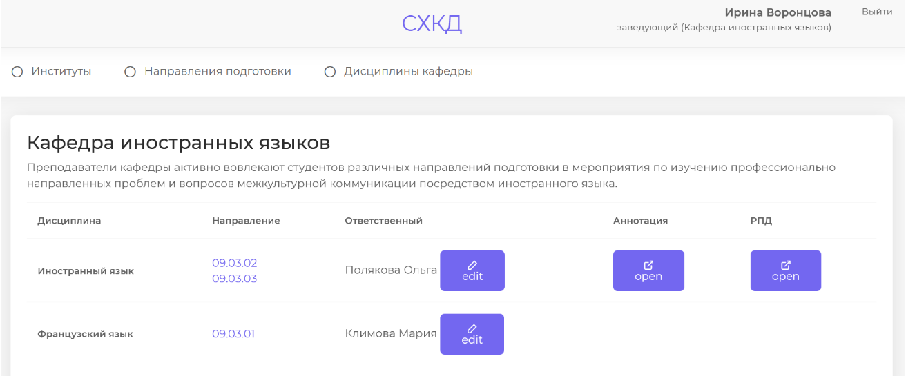
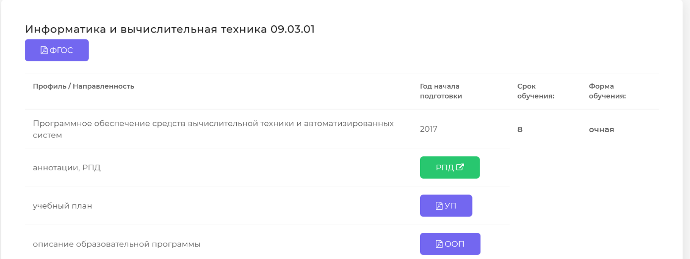

## Overview

### Цель

Целью работы являлось проектирование и реализация программного обеспечения, которое бы структурировано хранило документацию по преподаваемым дисциплинам в высшем учебном заведении. 

### Screenshots

### Разработа при помощи

- Python + Django Framework
- Bootstrap Framework
- MySql database

### Что я изучил

- Паттерн разрaботки MVC 
- Администрирование сайта с помощью django admin
- ORM - технология взаимодействия с бд через объектную модель данных
- организация маршрутизации url-адресов

### Продолжение разработки

Функционал реализован не в полной мере. Есть наработки по генерированию .docx и .pdf файлов наполняя шаблоны размещенные на сервере данными из базы.
